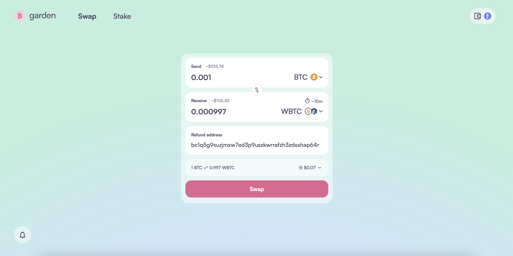
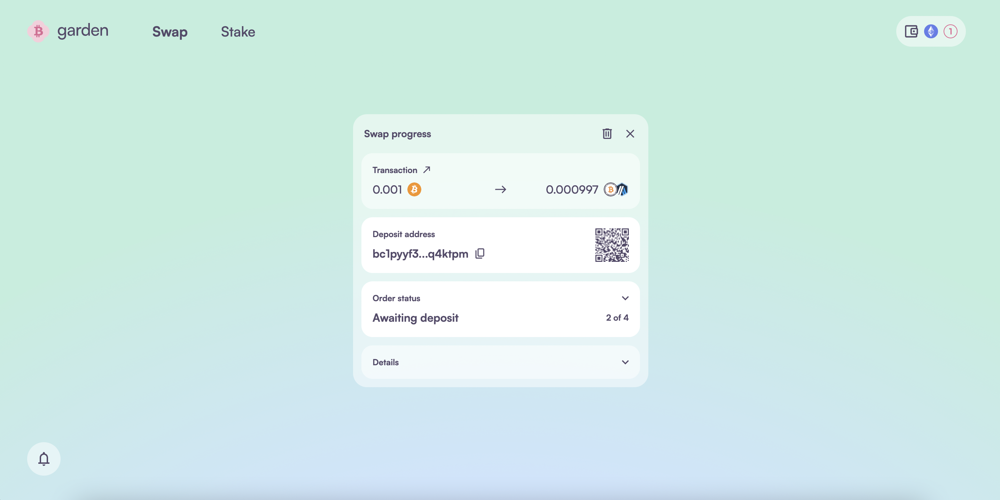
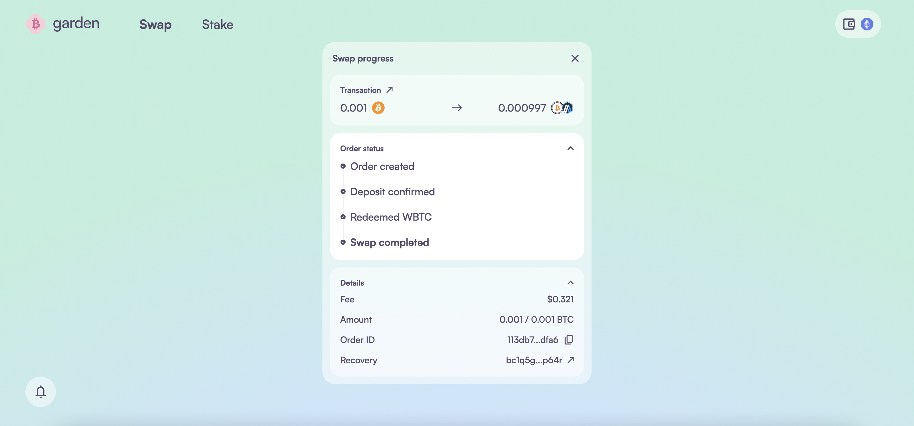

# Swap Bitcoin to any asset

Bridge Bitcoin to any asset on Garden by following these steps.

1. Open Garden's swap interface and connect both your **EVM wallet** and **Bitcoin wallet**.

2. Choose **Bitcoin (BTC)** as the **Send** asset and your desired asset and chain in **Receive** (e.g., cbBTC on Base).

3. Input the amount you wish to send or receive and hit the **Swap** button.

4. You’ll first be prompted to approve the transaction in your EVM wallet, then in your Bitcoin wallet to approve and send the Bitcoin.

5. Keep the browser open while the swap is in progress. You’ll receive a notification once it’s successful.

For subsequent swaps during an app session, you only need to sign once from the **Send** wallet.

### Swapping Bitcoin without connecting Bitcoin wallet

You can swap BTC without connecting your Bitcoin wallet, but you’ll need to connect your EVM wallet to sign the transaction. The process is almost identical to swapping any asset for BTC. The key differences are: after hitting Swap, you’ll have to manually copy the deposit address and send the exact BTC amount from your Bitcoin wallet. You’ll also need to add a Bitcoin recovery address to make sure your funds can be refunded safely if a solver doesn’t match the order

1. Please enter your Bitcoin refund address manually. This is where your BTC will be refunded if the swap doesn’t go through, so make sure the address is correct.

   

2. After creating a swap order, you'll see a Bitcoin deposit address on the swap page. To initiate the swap, send the exact BTC amount from your Bitcoin wallet to that address. Once the solver receives the funds, the swap will go through successfully.

   

3. Keep the browser open during the swap. You can monitor the real-time progress on swap page.

   